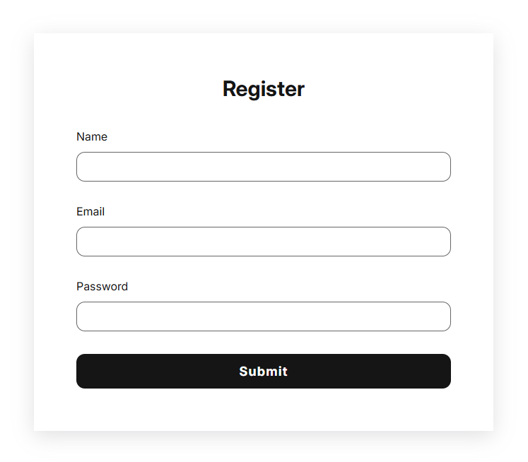

# Simple Register Form

A clean and responsive Register Form built with just HTML and CSS. This simple project is ideal for beginners to understand form structure, layout, and styling using CSS.

---

## Screenshot



---

## Features

- Minimal, modern design
- Fully responsive layout
- Basic input validation (required fields)
- Custom fonts and styling with Google Fonts
- Hover effects for the submit button

---

## File Structure

```
simple-register-form/
├── index.html
├── assets/
│ ├── style.css
│ └── screenshot.png (optional)
```

---

## Technologies Used

- HTML5
- CSS3 (Flexbox, Custom Properties)
- Google Fonts (Inter, Roboto)

---

## How to Use

1. Clone the repository or download the ZIP.
2. Open `index.html` in your web browser.
3. Customize the form as needed for your project.

---

## Contact

Created by Rjay Ibina – feel free to reach out!

---

## License

This is a demo project created for educational and portfolio purposes. No license is applied by default. You may modify, use, and share freely.